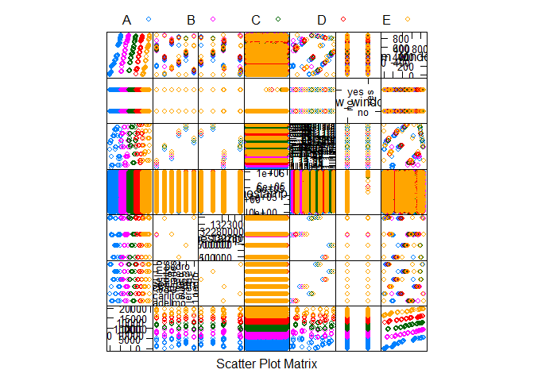

# Predicting Correct Weight Lifting Form
Weston Carloss  
July 29, 2017  
  

  
###     Synopsis  
  
Many people monitor *how much* of a certain exercise they perform using devices 
like Fitbit and Nike Fuelband. However, few people analyze *how well* they 
perform these exercises. This analysis uses data from these devices to predict 
if a user is lifting a dumbbell properly. The users form is classified into one 
of 5 "classes": **A - E**, where **A** represents **correct form** and **B-E** 
are common "improper forms**. Three prediction models are evaluated: 
**Random Forest**, **Bagging with Trees**, and **Boosting**. 3-Fold Cross 
Validation is used with each model to help select the optimal parameters. **Random Forest** gives the lowest estimated Out of Bag (OOB) error rate (0.0075), but it takes 
13.5 minutes to train the model.  **Bagging with Trees** gives the next best OOB 
error rate (0.0127), and it can be trained much faster ( < 1 minute) compared to the **Random Forest**. **Random Forest** was selected as the final model due to 
its accuracy.  
  
###     Basic Settings and Data Loading  
  
The analysis begins with loading any required R packages and the training and 
testing data. Please note that the **testing** data is not used in this 
analysis to train or evaluate the prediction models.  

```r
##  Load libraries for the plotting and generating prediction models
library(knitr); library(ggplot2); library(caret);

##  Download the test and training data
setwd("C:/Coursera/Data_Science/08_Machine_Learning/Week 4/Project")

if(!file.exists("./data")) {dir.create("./data")}
TrainUrl <- "https://d396qusza40orc.cloudfront.net/predmachlearn/pml-training.csv"
TestUrl <-  "https://d396qusza40orc.cloudfront.net/predmachlearn/pml-testing.csv"

download.file(TrainUrl, dest="./data/pml-training.csv") 
download.file(TestUrl, dest="./data/pml-testing.csv") 

##  Load the Training and Testing data sets
training <- read.csv("./data/pml-training.csv", na.strings=c(""," ","NA", "#DIV/0!"))
testing <- read.csv("./data/pml-testing.csv", na.strings=c(""," ","NA", "#DIV/0!"))
```
  
###     Exploratory Data Analysis and Data Cleaning  
  
The **training** data contains *19,622 samples* of *159 predictors* and 
*1 "classe" outcome* which denotes if the user performed the dumbbell curl 
correctly. Classe **A** represents **correct form**, and classe **B-E** represent 
various **incorrect forms**. The **testing** data contains *20 samples* with the 
same *159 predictors*. The **testing** data does not contain a *"classe" outcome*
variable. As stated above, the **testing** data is not used to train or evaluate 
the accuracy of the prediction models developed in this analysis.  
  
The list of predictors was reduced down to develop a concise model. The first 7 
columns contain the sample ID, name of the person performing the exercise, various timestamps, and window information. Clarification on these variables was unavailable, 
but the descriptions suggests that they're unimportant in predicting the class. 
This intuition is confirmed by the feature plot shown below. Therefore, these 
predictors were removed from the **training** and **testing** data sets.  
  
Looking at the structure of the **testing** and **training** data using the *str* 
command (omitted here for brevity) reveals that many predictors consist of 
almost entirely NA values. These predictors were removed from both data sets, 
leaving *52 predictors* and *1 "classe" outcome*. Finally, the last column in the 
**testing** data was renamed to **classe** in order to match the **training** 
data. Renaming this column has no effect on training the models.  

```r
##  Determine the number of samples and predictors/variables in the training and 
##      testing data
dim(training)
```

```
## [1] 19622   160
```

```r
dim(testing)
```

```
## [1]  20 160
```

```r
##  Visually assess if the first 7 columns (Sample ID, Exerciser's Name, Time 
##      Stamps, and Window) are useful in predicting classe
featurePlot(x = training[, 1:7], y = training$classe, plot = "pairs", 
            auto.key = list(columns = 5))
```

<!-- -->

```r
##  Delete the first 7 columns from the Training and Testing Data
trainingCut <- training[,-c(1:7)]
testingCut <- testing[,-c(1:7)]

##  Identify columns and remove columns that are predominantly NA,
NA_columns <- which(colSums(is.na(trainingCut)) > (0.8*nrow(trainingCut)))
trainNoNA <- trainingCut[,-NA_columns]
testNoNA <- testingCut[,-NA_columns]

##  Rename the problem_id column in the testing data so column names match between 
##      training and testing data
colnames(testNoNA)[53] = "classe"
```
  
###     Model Training and Comparison  
  
Before training any models, the **training** data was split into two groups called **newTrain** and **newTest**, which were used to train and evaluate the models, respectively.  

```r
##  Split the training data into "newtrain" and "newTest"
set.seed(123)
inNewTrain <- createDataPartition(y = trainNoNA$classe, p = 0.7)[[1]]
newTrain <- trainNoNA[inNewTrain, ]
newTest <- trainNoNA[-inNewTrain, ]

##  Clear out unneeded data frames to save memory
rm(testing, testingCut, training, trainingCut, NA_columns, trainNoNA)
```
  
After splitting the data, three model types were trained:  **random forest**, 
**boosting**, and **bagging (with trees)**. **Random forest** and **boosting** 
often have the best prediction accuracy in data science competitions. **Random forests** splits the data using many combinations of randomly selected variables. The final 
combination of trees is selected by averaging or voting between the many available combinations. **Boosting** generates a weighted combination of a large number of 
predictors, which may be weak predictors separately. The model averaging used 
in **bagging** should offer a good balance between bias and variance. All of 
these models could suffer from overfitting, meaning the model fits the data and 
the "noise" in the **newTrain** data, but poorly fits the **newTest** data. 
3-fold cross validation was used to reduce the likelihood of overfitting, and 
to aid in selecting the predictors. In theory, using more folds would reduce 
prediction bias, but increase prediction variance. 5-fold and 10-fold cross 
validations were tested with **random forests** and **boosting**, but neither 
improved accuracy, and they dramatically increased computation time, making the 
models less scalable. Parallel processing was used to speed up training the 
**random forest** model.  

```r
##                          Random Forest Model
#
##  Enable Parallel Processing
library(parallel)
library(doParallel)
cluster <- makeCluster(detectCores() - 1) # convention to leave 1 core for OS
registerDoParallel(cluster)

##  Set RF training control to 3-fold Cross Validation with Parallel Processing
trControlRF <- trainControl(method = "cv", number = 3, allowParallel = TRUE)

##  Random Forest performs faster using the method x = , y = , instead of the formula notation
trainPred <- newTrain[,-53]
trainOut <- newTrain[,"classe"]

##  Train the Random Forest Model and Calculate the Run Time
set.seed(4567)
startTime <- proc.time()
rfMod <- train(x = trainPred, y = trainOut, trControl = trControlRF, 
                method = "rf", importance = TRUE, proximity = TRUE)
##  Calculate runtime
elapsedRFMod <- proc.time() - startTime
timeRFMod <- (elapsedRFMod[3])/60

##  Return to Single-threaded operation
stopCluster(cluster)
registerDoSEQ()


##                          Bagging Model
#
##  Set Bagging training control to 3-fold Cross Validation
trControlBag <- trainControl(method = "cv", number = 3)

##  Train the Bagging Model and Calculate the Run Time
##              set.seed(4567)
startTime <- proc.time()
bagMod <- train(classe ~., data = newTrain, method = "treebag", 
                  trControl = trControlBag)

##  Calculate runtime
elapsedBagMod <- proc.time() - startTime
timeBagMod <- (elapsedBagMod[3])/60


##                          Boosting Model
#
##  Set Boosting training control to 3-fold Cross Validation
trControlGBM <- trainControl(method = "repeatedcv", number = 3, repeats = 1)

##  Train the Boosting Model and Calculate the Run Time
##              set.seed(4567)
startTime <- proc.time()
boostMod <- train(classe ~., data = newTrain, method = "gbm", 
                  trControl = trControlGBM, verbose = FALSE)
##  Calculate runtime
elapsedBoostMod <- proc.time() - startTime
timeBoostMod <- (elapsedBoostMod[3])/60
```
  
The accuracy estimates from predicting the **newTrain** data would be overly 
optimistic.  Therefore, each model's estimated out-of-bag (OOB) error rate is 
based on predictions using the **newTest** data.  
  
As shown in the table below, **Random Forest** had the lowest estimated OOB error 
rate (0.0075) and **Bagging** was next best (0.0127). However, the **Bagging** 
model trained much more quickly ( < 1 minute vs. 13.5 minutes for **Random Forest**). 
Despite the slower speed, the **Random Forest** model was selected as the final model.

```r
##  Generate predictions for Random Forest, Bagging, and Boosting models
predRFMod <- predict(rfMod, newdata = newTest)

predBagMod <- predict(bagMod, newdata = newTest)

predBoostMod <- predict(boostMod, newdata = newTest)


##  Calculate accuracy for Random Forest, Bagging, and Boosting models
cmRFMod <- confusionMatrix(predRFMod, newTest$classe)$overall[1]
cmRFMod_Error <- 1 - cmRFMod

cmBagMod <- confusionMatrix(predBagMod, newTest$classe)$overall[1]
cmBagMod_Error <- 1 - cmBagMod

cmBoostMod <- confusionMatrix(predBoostMod, newTest$classe)$overall[1]
cmBoostMod_Error <- 1 - cmBoostMod


##  Create Summary Table of Error Rate and Run Time for the 3 models
Model <- c('Random Forest (3-fold CV)', 'Bagging (3-fold CV)', 
           'Boosting (3-fold CV)')
OOB_ErrorRate <- round(rbind(cmRFMod_Error, cmBagMod_Error, cmBoostMod_Error), 4)
Run_Time_minutes <- round(rbind(timeRFMod, timeBagMod, timeBoostMod), 2)
results <- as.data.frame(cbind(Model, OOB_ErrorRate, Run_Time_minutes), row.names = NULL)
colnames(results) <- c('Model', "OOB_Error", "Run_time_minutes")
print(results, row.names = FALSE)
```

```
##                      Model OOB_Error Run_time_minutes
##  Random Forest (3-fold CV)    0.0075            13.55
##        Bagging (3-fold CV)    0.0127             0.74
##       Boosting (3-fold CV)    0.0416             2.42
```
  
###     Conclusion  
Personal Activity Monitors such as the Fitbit and Nike FuelBand are almost 
exclusively used to track *how much exercise* is performed. This analysis shows 
that these devices can also be used to accurately assess *how well* the exercise 
is performed. A **Random Forest** model trained on a reasonably large data 
set can determine with greater than 99% accuracy whether a dumbbell lift is being 
performed correctly, and even identify a common number of improper techniques. 
Given further training with a much wider range of exercises, this type of model 
could be implemented in a device to provide real-time feedback during a workout. 
This could maximize the effectiveness of the user's workout, while also 
minimizing chance of injury due to poor form.
